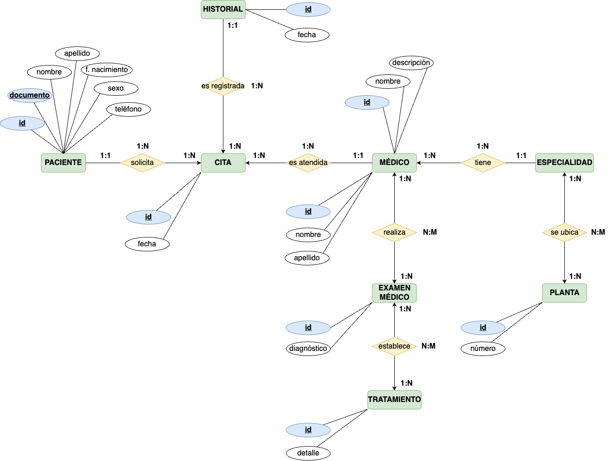

  
# Hospital
  
Se requiere realizar una aplicación para la gestión de un hospital. En este hospital, los pacientes que llegan al servicio de urgencias del hospital son examinados y, dependiendo de su estado de salud, son ingresados en la planta correspondiente (traumatología, cuidados intensivos, ...) bajo la supervisión de un médico responsable.

## Solución a implementar

- ### Detecta y/o define al menos 8 tablas en la solución propuesta (sin tener en cuenta las relaciones).
    - Paciente.
    - Cita.
    - Historial.
    - Médico.
    - Especialidad.
    - Planta.
    - Examen Médico.
    - Tratamiento.

- ### Crea el Diagrama ER.
    

    
    

- ### Crea el Modelo Relacional.
    

    
    

- ### Realiza y justifica la Normalización de la BBDD.

- #### 1NF

    - La **primera forma normal** establece que los datos deben estar organizados en tablas, y cada celda de la tabla debe contener un solo valor atómico (indivisible). Además, cada columna de la tabla debe tener un nombre único y no puede haber duplicados en las filas.

    - Para verificar que se cumple con la 1NF, se ha asegurado que todas las entidades se representen mediante tablas, que cada atributo tenga un único valor en cada celda y que no haya duplicados en las filas.

- #### 2NF

    - La **segunda forma normal** establece que una tabla debe cumplir con la 1NF y, además, todos los atributos no clave deben depender completamente de la clave primaria. En otras palabras, no debe haber dependencias funcionales parciales.

    - Para verificar que se cumple con la 2NF, se ha examinado cada atributo no clave de cada tabla y se ha asegurado de que dependa completamente de la clave primaria de esa tabla.

- #### 3NF

    - La **tercera forma normal** establece que una tabla debe cumplir con la 2NF y, además, no debe haber dependencias transitivas. Esto significa que los atributos no clave deben depender únicamente de la clave primaria y no de otros atributos no clave.

    - Para verificar que se cumple con la 3NF, se ha examinado cada atributo no clave de cada tabla y se ha asegurado de que dependa únicamente de la clave primaria y no de otros atributos no clave.

- #### 4NF

    - La **cuarta forma normal** establece que una tabla debe cumplir con la 3NF y, además, no debe haber dependencias multivaluadas. Esto significa que los atributos no clave no deben tener dependencias de valores múltiples entre sí.
    
    - Para verificar que se cumple con la 4NF, se ha examinado cada atributo no clave de cada tabla y se ha asegurado de que no haya dependencias multivaluadas entre ellos.

    

    
    

- ### Programa la inclusión de elementos en la BBDD.

<h3>

- [Creación de tablas, índices, vistas, procedimientos, funciones y trigger.](sql/hospital.sql)

</h3>

