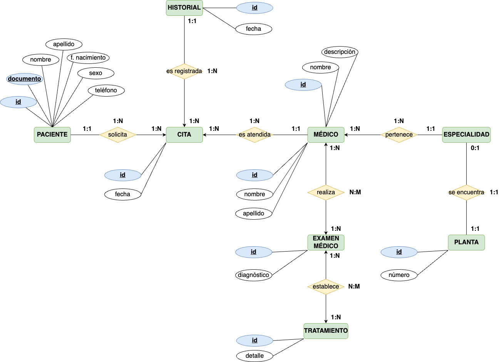
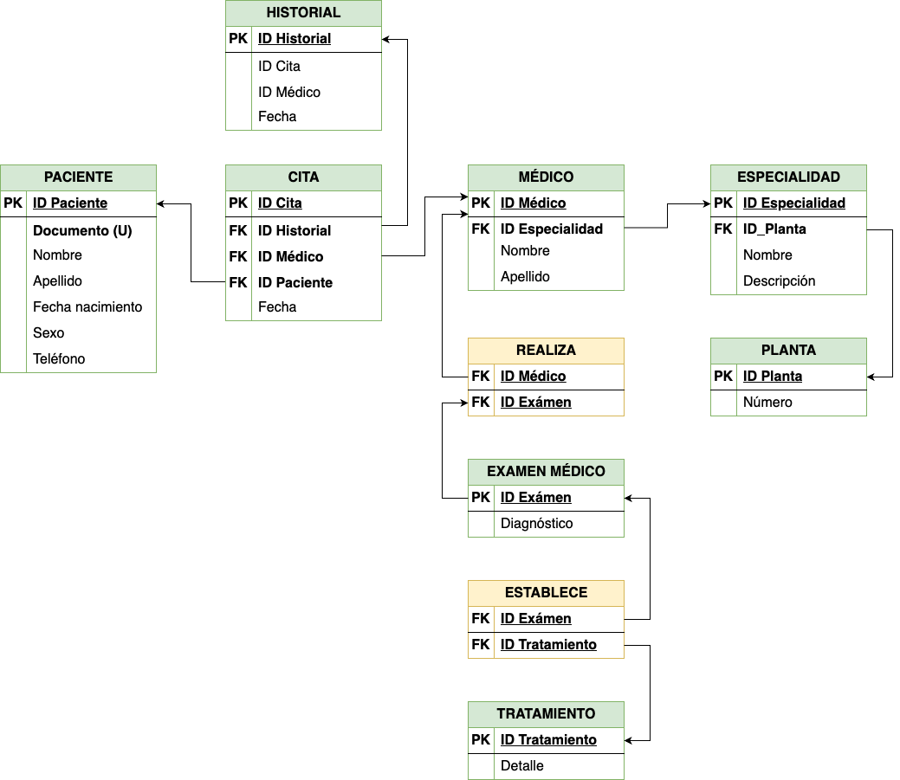

  
# Hospital
  
Se requiere realizar una aplicación para la gestión de un hospital. En este hospital, los pacientes que llegan al servicio de urgencias del hospital son examinados y, dependiendo de su estado de salud, son ingresados en la planta correspondiente (traumatología, cuidados intensivos, ...) bajo la supervisión de un médico responsable.

## Solución a implementar

- Detecta y/o define al menos 8 tablas en la solución propuesta, __sin tener en cuenta las relaciones__.
    - Paciente.
    - Cita.
    - Historial.
    - Médico.
    - Especialidad.
    - Planta.
    - Examen Médico.
    - Tratamiento.

- Crea el Diagrama ER.
    

    
    

- Crea el Modelo Relacional.
    

    
    

- Realiza y justifica la Normalización de la BBDD.
    - 
    

    
    

- Programa la inclusión de elementos en la BBDD.

